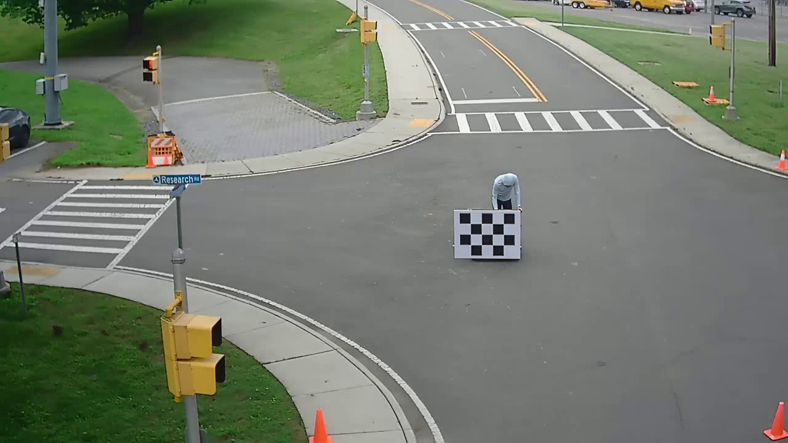
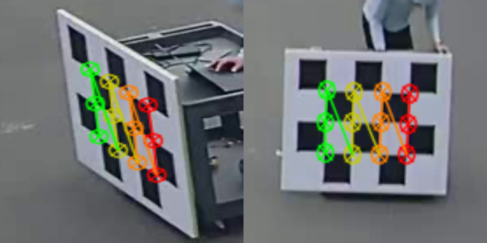

# collect_camera_camera_images README

## Summary
This script allows users to capture live images and optionally check for checkerboards and store results.

---
## Usage

The script works out-of-the-box with default settings but can be customized via command-line arguments.

**Default**

If you run the script without arguments:

All available cameras in CAMERA_CONFIG will be used.

Processed images and CSV will be stored in ./processed_data (relative to the script).

You can capture live frames continuously; press Ctrl+C to stop.

After capturing frames, press y to save images. Any other key will skip storing them.

**Passing Custom Args**

You can pass custom arguments for camera selection, output folder, or to analyze stored images:
```bash
# Capture from specific cameras and store results
python stored_camera_camera_images.py --cameras VisualCamera4 VisualCamera5 --output ./my/output/folder

# Capture and then analyze all stored images in the output folder
python stored_camera_camera_images.py --analyze-stored
```

### Arguments

| Argument| Description| Default|
|----|----|---|
| `--cameras`        | List of camera names to use| All cameras in `CAMERA_CONFIG` |
| `--output`| Folder to store captured images and CSV| `./processed_data`|
| `--analyze-stored`| Flag to analyze all stored images for checkerboards after capture | No Analysis|


### Adding Your Own Camera Streams

the script takes camera selections from the "CAMERA_CONFIG" section of the script.

```python
CAMERA_CONFIG = {
    "VisualCamera4": ("axis", "192.168.55.30"),
```
Each camera entry should have the following form:
```
"CameraName": ("device_type", "ip_or_host:port")
```
- **CameraName**: A unique name for the camera.

- **device_type**: Options include: pelco, axis, radar, or flir.

- **ip_or_host:port**: The address of your camera or stream. For pelco and axis cameras, the script automatically uses their RTSP paths; for radar it appends /stream; for flir it uses the IP directly.

**Example**:
If you wanted to add a new Axis camera at IP 192.168.1.50, you would change the camera entry to:

```
CAMERA_CONFIG["MyAxisCam"] = ("axis", "192.168.1.50")
```

After you save your script it can be run using the new camera configuration.  By default all cameras included in the configuration will be used.  However, you can specify just the new camera with

```
python collect_camera_camera_images.py --cameras MyAxisCam --output ./my/output/folder
```

Processing may be slow with livestreams in which case you may choose to forgo looking for checkerboards by omitting the `--analyze-stored` flag.

**Notes**
- Make sure the camera supports RTSP streaming and that your network/firewall settings allow access.

- The script will exit if you specify a camera name that isn’t in CAMERA_CONFIG.

---
## Requirements

- Python 3.9+  

**Install dependencies:**

```bash
pip install opencv-python numpy scikit-image
```
---

## Sample Data
Here is an example of a raw image.



---

## Example Output
here is an example of the paired output images with checkerboards drawn.


csv includes:
|Camera name|Timestamp|Image Path|Checkerboard found (True/False)|Flattened corner coordinates (if found)|
|---|---|---|---|---|
|VisualCamera5|1715969042|your/png/path.png|True|Corners|
---
## Troubleshooting
- The script requires filenames to follow the format <CameraName>_YYYY-MM-DD-HH-MM-SS_microseconds.png
- users must press "y" when viewing images for images to be stored, any other key will skip storign.